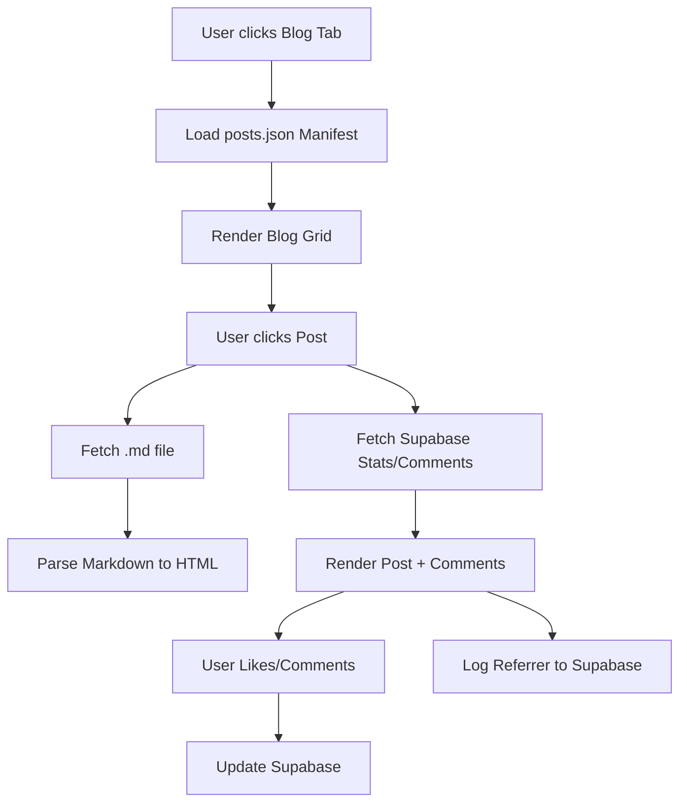

# Blog Implementation Plan

## Overview
Add a blog section to the Rhubarb landing page using Markdown files for content and Supabase for interactive features (comments, likes, and referrer tracking).

## 1. Content Management
- **Storage**: Markdown files in `public/blog/*.md`.
- **Images**: Store images in `public/blog/images/`. Reference them in Markdown using ``.
- **Metadata**: Use Frontmatter (YAML) at the top of Markdown files for titles, dates, and excerpts.
- **Parsing**: Use the `marked` library to convert Markdown to HTML.
- **Workflow (Word to Markdown)**:
  - Write your post in Word.
  - Use a tool like [Word to Markdown Converter](https://word2md.com/) or [Pandoc](https://pandoc.org/).
  - Copy the resulting Markdown into a new `.md` file in `public/blog/`.
  - Add the Frontmatter block at the top.

## 2. Supabase Schema
Run the following SQL in your Supabase SQL Editor:

```sql
-- Table for tracking post-level stats
CREATE TABLE blog_stats (
    slug TEXT PRIMARY KEY,
    likes_count INTEGER DEFAULT 0,
    view_count INTEGER DEFAULT 0
);

-- Table for comments and replies
CREATE TABLE blog_comments (
    id UUID PRIMARY KEY DEFAULT uuid_generate_v4(),
    post_slug TEXT NOT NULL,
    parent_id UUID REFERENCES blog_comments(id),
    author_name TEXT NOT NULL,
    content TEXT NOT NULL,
    created_at TIMESTAMP WITH TIME ZONE DEFAULT NOW()
);

-- Table for tracking referrers (backlinks)
CREATE TABLE blog_referrers (
    id UUID PRIMARY KEY DEFAULT uuid_generate_v4(),
    post_slug TEXT NOT NULL,
    referrer_url TEXT NOT NULL,
    created_at TIMESTAMP WITH TIME ZONE DEFAULT NOW()
);
```

## 3. UI Components
- **Blog Tab**: Add a "Blog" button to the tab navigation.
- **Blog Grid**: A list of cards showing post titles, dates, and excerpts.
- **Post View**: A full-page or modal view for reading the post.
- **Interaction Bar**: Likes button and view counter.
- **Comment Section**: Nested comments with reply functionality.

## 4. Technical Workflow
1. **Initialization**: On page load, fetch the list of available blog posts (from a `posts.json` manifest or by scanning the directory if possible, though a manifest is more reliable for client-side).
2. **Rendering**:
   - When a post is selected, fetch the `.md` file.
   - Parse Frontmatter and Content.
   - Fetch interactions (likes, comments) from Supabase.
3. **Tracking**:
   - On post load, increment `view_count` in Supabase.
   - Capture `document.referrer` and log it to `blog_referrers` if it's from an external domain.

## 5. Proposed File Structure
- `public/blog/`: Directory for `.md` files.
- `public/blog/posts.json`: A manifest file listing all posts.
  ```json
  [
    {
      "slug": "resilience-of-rhubarb",
      "title": "The Resilience of Rhubarb",
      "date": "2025-12-23",
      "excerpt": "Why we chose the rhubarb plant...",
      "file": "/blog/resilience-of-rhubarb.md"
    }
  ]
  ```
- `src/blog.js`: Logic for fetching, parsing, and Supabase integration.
- `src/style.css`: Styles for the blog section.

## 6. UI Design Details
- **Search Bar**: A text input at the top of the blog section to filter posts by keyword.
- **Blog Grid**: Use CSS Grid for a responsive layout of cards. Each card shows the title, date, and a "Read More" button.
- **Post Detail**: A full-width container that appears when a post is selected. It includes:
  - Back button to return to the grid.
  - Post content (rendered from Markdown).
  - Interaction bar (Like button with count, View count).
  - Comment section (Form to add comment, list of existing comments/replies).

## 7. JavaScript Logic (src/blog.js)
- `loadBlogManifest()`: Fetches `posts.json`.
- `renderBlogGrid(filterText = '')`: Generates HTML for the list of posts, filtered by `filterText`.
- `loadPost(slug)`:
  - Fetches the `.md` file.
  - Uses `marked.parse()` for conversion.
  - Calls Supabase to increment views and fetch comments.
- `handleLike(slug)`: Increments like count in Supabase.
- `handleComment(slug, content, parentId)`: Saves a new comment to Supabase.

## 8. Referrer Tracking (Backlinks)
When `loadPost(slug)` is called:
```javascript
const referrer = document.referrer;
if (referrer && !referrer.includes(window.location.hostname)) {
    // Log to Supabase blog_referrers table
    supabase.from('blog_referrers').insert({ post_slug: slug, referrer_url: referrer });
}
```

## 9. Security & Environment Variables
- **Frontend Keys**: The `VITE_SUPABASE_URL` and `VITE_SUPABASE_ANON_KEY` are intended to be public. They allow the browser to talk to Supabase. Security is handled by **Supabase Row Level Security (RLS)**, not by hiding these keys.
- **GitHub Security**: I have updated `.gitignore` to ensure your `.env` file is never uploaded to GitHub.
- **Deno for Backend**: If you need to perform "secret" operations (like sending emails or using a private API), you should use **Supabase Edge Functions**. These run on **Deno** and are highly secure because they never expose their environment variables to the browser.
- **Example Deno Function**: I've created a sample Deno function in `supabase/functions/track-referrer/index.ts` that shows how to securely log data using Deno on the backend.

## 10. Mermaid Diagram


