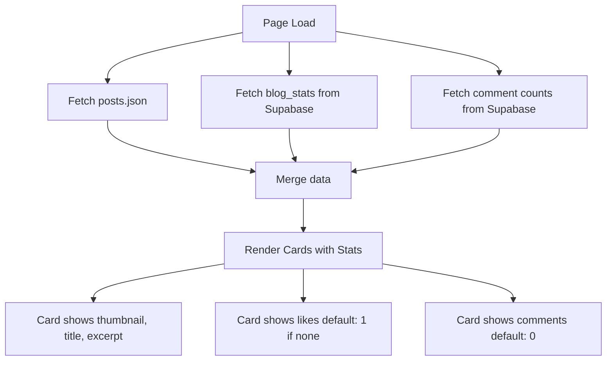
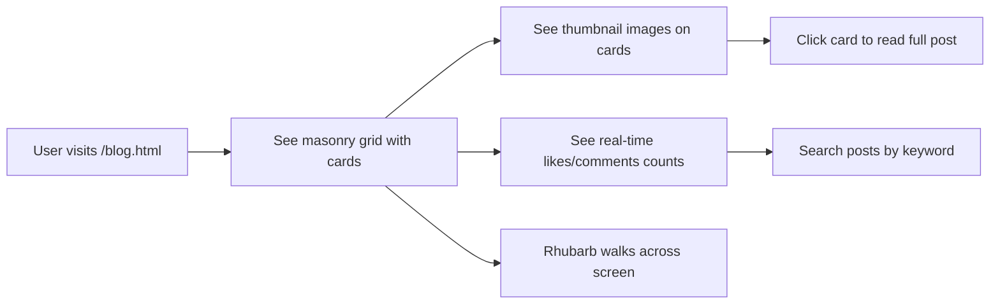

# Sage Blog Page Redesign Plan

## Overview
Redesign the Sage (blog) page with a modern, visually appealing masonry layout featuring blog post cards with thumbnails, descriptions, and real-time engagement metrics (likes/comments) fetched from Supabase.

## Current State Analysis
- **HTML**: Basic blog grid layout in [`blog.html`](../blog.html)
- **JavaScript**: [`src/blog-page.js`](../src/blog-page.js) handles post loading and interactions
- **CSS**: Blog styles in [`src/style.css`](../src/style.css:1093) (lines 1093-1419)
- **Data**: Posts defined in [`public/blog/posts.json`](../public/blog/posts.json)

## Design Requirements

### Visual Elements
1. **Background Image**: Add `rhubarb school.jpg` as background
2. **Masonry Layout**: Pinterest-style card arrangement with varying heights
3. **Thumbnail Images**: Each post card should have a featured image
4. **Animated Rhubarb**: Include the walking rhubarb animation component

### Card Design
```
+---------------------------+
|  [Thumbnail Image]        |
+---------------------------+
|  📅 Date                  |
|  Title (bold, larger)     |
|  Description excerpt...   |
|                           |
|  ❤️ X likes  💬 Y comments |
|  [Read More →]            |
+---------------------------+
```

### Engagement Metrics
- Fetch real-time likes and comments from Supabase
- Default values if no data: likes = 1, comments = 0
- Show metrics on each card before entering post detail

## Technical Implementation

### 1. Update posts.json Schema
Add `thumbnail` field to each post:
```json
{
  "slug": "post-slug",
  "title": "Post Title",
  "date": "2025-12-24",
  "excerpt": "Brief description...",
  "file": "/blog/post.md",
  "thumbnail": "/blog/thumbnails/post-thumb.jpg"
}
```

### 2. Import Rhubarb Walker
In `blog-page.js`, add:
```javascript
import './rhubarb-walker.js';
```

### 3. Fetch Stats for Cards
Create function to batch-fetch all post stats:
```javascript
async function loadAllPostStats() {
    if (!supabase) return {};
    
    const { data } = await supabase
        .from('blog_stats')
        .select('slug, likes_count, view_count');
    
    const stats = {};
    if (data) {
        data.forEach(row => {
            stats[row.slug] = row;
        });
    }
    return stats;
}

async function loadAllCommentCounts() {
    if (!supabase) return {};
    
    const { data } = await supabase
        .from('blog_comments')
        .select('post_slug');
    
    const counts = {};
    if (data) {
        data.forEach(row => {
            counts[row.post_slug] = (counts[row.post_slug] || 0) + 1;
        });
    }
    return counts;
}
```

### 4. CSS Masonry Layout
```css
.blog-grid {
    columns: 3 350px;
    column-gap: 2rem;
}

.blog-card {
    break-inside: avoid;
    margin-bottom: 2rem;
}

@media (max-width: 768px) {
    .blog-grid {
        columns: 1;
    }
}
```

### 5. Background Styling
```css
.main-content.blog-content {
    background: 
        linear-gradient(
            rgba(255, 255, 255, 0.9),
            rgba(255, 255, 255, 0.85)
        ),
        url('/rhubarb school.jpg');
    background-size: cover;
    background-position: center;
    background-attachment: fixed;
    min-height: 100vh;
}
```

### 6. Enhanced Card Styles
```css
.blog-card {
    background: white;
    border-radius: 16px;
    overflow: hidden;
    box-shadow: 0 8px 24px rgba(0,0,0,0.08);
    transition: all 0.3s ease;
    border: 1px solid var(--rhubarb-light-gray);
}

.blog-card-thumbnail {
    width: 100%;
    height: 180px;
    object-fit: cover;
    border-bottom: 3px solid var(--rhubarb-green);
}

.blog-card:hover {
    transform: translateY(-8px) scale(1.02);
    box-shadow: 0 20px 50px rgba(74, 124, 89, 0.2);
    border-color: var(--rhubarb-green);
}

.blog-card-stats {
    display: flex;
    gap: 1.5rem;
    padding-top: 1rem;
    border-top: 1px solid var(--rhubarb-light-gray);
    color: var(--rhubarb-gray);
}

.stat-item {
    display: flex;
    align-items: center;
    gap: 0.4rem;
    font-size: 0.9rem;
}
```

## File Changes Summary

| File | Changes |
|------|---------|
| [`blog.html`](../blog.html) | Add blog-content class to section |
| [`src/blog-page.js`](../src/blog-page.js) | Import rhubarb-walker, add stats fetching, update card rendering |
| [`src/style.css`](../src/style.css) | Add masonry layout, background, enhanced card styles |
| [`public/blog/posts.json`](../public/blog/posts.json) | Add thumbnail field to posts |

## Card Component Data Flow



## User Interaction Flow



## Responsive Breakpoints

| Viewport | Columns | Card Width |
|----------|---------|------------|
| Desktop 1200px+ | 3 | ~350px each |
| Tablet 768-1199px | 2 | ~350px each |
| Mobile &lt;768px | 1 | Full width |

## Thumbnail Strategy

Since the blog posts may not have existing thumbnails, we have options:
1. **Use placeholder images**: Create generic rhubarb-themed placeholder
2. **Generate from Rhubarb assets**: Use existing images like `generalRhubarb.png`, `fightingRhubarb.png`
3. **Add to markdown frontmatter**: Later enhancement to specify per-post images

**Recommended**: Use existing Rhubarb images as default thumbnails for now.

## Implementation Order

1. Update `posts.json` with thumbnail paths using existing images
2. Update `blog-page.js`:
   - Import rhubarb-walker.js
   - Add Supabase stats fetching functions
   - Update `renderBlogGrid()` to include thumbnails and real stats
3. Update `src/style.css`:
   - Add masonry layout styles
   - Add background image styling
   - Add enhanced card styles with thumbnail support
   - Add hover animations
   - Add responsive breakpoints
4. Update `blog.html`:
   - Add class for background styling to main section
5. Test complete functionality

## Success Criteria

- [ ] Cards display in masonry layout
- [ ] Each card shows thumbnail image
- [ ] Likes count shows real value from Supabase or default 1
- [ ] Comments count shows real value or default 0
- [ ] Background image displays with overlay
- [ ] Rhubarb walker animates across screen
- [ ] Cards have smooth hover animations
- [ ] Layout is responsive on mobile
- [ ] Search functionality still works
- [ ] Clicking card opens full post correctly
